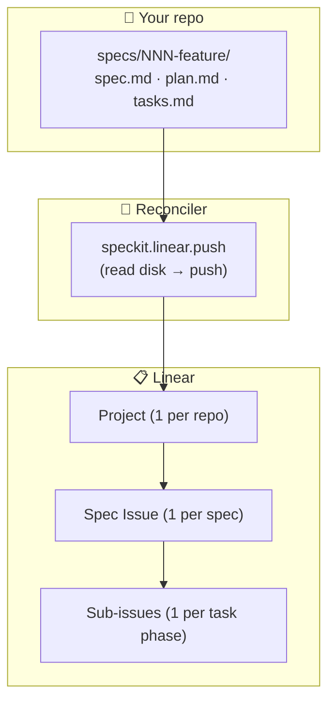
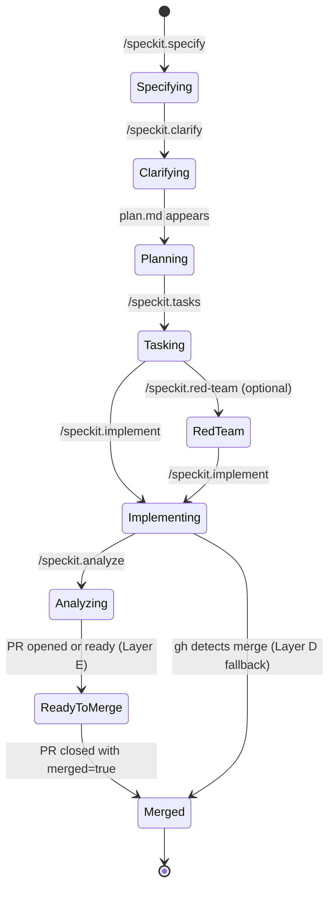

# Linear — a Spec Kit extension

**Mirror every spec on disk into a Linear Issue, so you can see — and steer — every active spec across every repo from a single pane.** The filesystem stays the single source of truth; Linear is the read-only mirror, kept in sync by spec-kit's own `after_*` hooks plus local git hooks plus a GitHub Actions webhook.

- **Version:** 0.1.0
- **Repository:** <https://github.com/ashbrener/spec-kit-linear>
- **License:** MIT
- **Requires:** Spec Kit ≥ 0.1.0 · bash 4+ · `curl` · `jq` · `gh` (optional) · `git`
- **Commands:** `/speckit.linear.install`, `/speckit.linear.seed`, `/speckit.linear.push`, `/speckit.linear.pull`, `/speckit.linear.status` (auto-invoked on every `/speckit.*` lifecycle command)

## Why a Linear bridge

You're running spec-kit in four repos at once. Each repo has its own `specs/NNN-feature/` tree, its own feature branch, its own worktree somewhere on disk. The filesystem holds every fact perfectly — your head does not.

| Situation | Without the bridge | With the bridge |
|---|---|---|
| Which spec is in which phase across which repo? | Open four shells; `find`; remember which branch each spec lives on | One Linear view, every active spec stack-ranked by phase |
| Did the last clarify session ratify? | Re-grep `## Clarifications` in `spec.md` | Linear comment on the spec Issue per `### Session YYYY-MM-DD` |
| Which worktree owns this spec right now? | `git worktree list` + cross-reference branches | Memory block on the spec Issue's description |
| PR landed — is Linear in sync? | Manual edit | GitHub Action flips the Issue to `Merged` within a minute |

The extension turns each spec into a real Linear Issue with phase, branch, worktree pointer, current task, and clarify history visible at a glance. No daemons, no databases, no reverse-sync surprises.

## How it works



1. The extension installs an `after_*` hook for every `/speckit.*` lifecycle command. Every time you specify, clarify, plan, tasks, implement, or analyze, the hook fires `/speckit.linear.push`.
2. `push` reads every `specs/NNN-feature/` directory on disk, infers the spec's lifecycle phase from artifact presence (per FR-012), and idempotently writes to Linear: spec Issue title + description (with memory block), sub-issue per task phase (with checklist mirror), blocking relations, clarify-session comments, `phase:*` / `task-phase:*` / `speckit-spec:NNN` labels.
3. Local git hooks (`post-checkout`, `post-commit`, `post-merge`) also fire the reconciler, so branch switches and ticked-off tasks land in Linear without re-running a spec-kit command.
4. A shipped GitHub Action (`spec-kit-linear-sync.yml`) listens for PR events and flips the spec Issue to `Ready-to-merge` and `Merged` in real time — even when your laptop is closed.
5. The reconciler is **filesystem-driven**: it never reads Linear state and writes back to disk. Linear is the mirror; the markdown wins every conflict.

## Install

Until this extension lands in the spec-kit community catalog, install from the GitHub archive URL (the CLI's `--from` flag expects a direct ZIP, not a repo URL):

```bash
specify extension add linear --from https://github.com/ashbrener/spec-kit-linear/archive/refs/heads/main.zip
```

Or install from a local checkout (symlinks rather than copies, so your local edits flow through):

```bash
specify extension add /path/to/spec-kit-linear --dev
```

Run this from a **separate consumer repo**, not from inside the bridge's own checkout. The install detects source-equals-target and halts with exit 2 (FR-046) rather than copy the bridge into itself.

Once the extension is listed in the catalog, the shorter form will work:

```bash
specify extension add linear
```

Either path registers the `after_*` hooks into your project's `.specify/extensions.yml`, drops local git hooks into `.git/hooks/`, and scaffolds `.specify/extensions/linear/linear-config.yml`.

If the install reports a vendored `.git/` warning under `.specify/extensions/linear/`, run `rm -rf .specify/extensions/linear/.git` and re-run the install (FR-049). The bridge does not auto-delete that directory — operator consent is required.

## Adopt — the 3 steps every project takes

1. **Run `/speckit.linear.install`.** This is the interactive install ceremony. It resolves your Linear Team UUID (auto-picks if your workspace has one team; prompts otherwise), creates or attaches a Linear Project for this repo, captures your operator identity via Linear's `viewer` query, writes everything to `.specify/extensions/linear/linear-config.yml` (committed to the repo so collaborators inherit the binding), and optionally installs the GitHub Action layer.

2. **Run `/speckit.linear.seed`.** One-shot per Linear workspace — creates the 9 lifecycle workflow states (`Specifying`, `Clarifying`, `Planning`, `Tasking`, `Red-team`, `Implementing`, `Analyzing`, `Ready-to-merge`, `Merged`), the 9 `phase:*` labels, and `task-phase:1`..`task-phase:9`. Captures every UUID at creation and writes it back into `linear-config.yml` (per FR-032) so renames in Linear's UI never break the bridge.

3. **Use spec-kit as normal.** Every `/speckit.specify`, `.clarify`, `.plan`, `.tasks`, `.implement`, `.analyze` now fires `/speckit.linear.push` automatically. The first run for any pre-existing spec backfills retroactively — Linear converges to the correct end-state without producing spurious intermediate-phase comments (FR-014).

## Usage

The five command surface:

| Command | Direction | Description |
|---|---|---|
| `/speckit.linear.install` | install-time only | Resolves Team / Project / operator UUIDs, writes `linear-config.yml`, registers hooks, optionally installs the GitHub Action. |
| `/speckit.linear.seed` | workspace setup | Creates lifecycle workflow states + labels. Idempotent; safe to re-run. |
| `/speckit.linear.push` | disk → Linear (write) | The reconciler. Fires automatically on every `/speckit.*` hook; also invokable on demand. |
| `/speckit.linear.pull` | Linear → terminal (read-only) | Cross-repo unified inspect. Surfaces every spec Issue across every repo bound to the workspace. |
| `/speckit.linear.status` | terminal (read-only) | Drift report — per spec, flags mismatches between disk and Linear (lifecycle, branch, last-touched, checklist completion). |

### Examples

**Manual reconcile of one spec — usually unnecessary, but useful for recovery:**

```bash
/speckit.linear.push --spec 003
```

**Reconcile every spec in this repo:**

```bash
/speckit.linear.push --all
```

**Dry-run — print what would change, mutate nothing:**

```bash
/speckit.linear.push --all --dry-run
```

**Inspect what Linear thinks about every spec in this repo:**

```bash
/speckit.linear.status --all
```

**Cross-repo: every spec across every repo bound to your Linear workspace:**

```bash
/speckit.linear.pull --workspace-wide
```

## What lands in Linear

Spec-kit artifacts map to Linear primitives one-to-one:

| Filesystem | Linear primitive |
|---|---|
| Consumer repository | **Project** (1 per repo, stamped with the repo's directory name) |
| Spec (`specs/NNN-feature/`) | **Issue** under that Project, identified by the workspace label `speckit-spec:NNN` (FR-004b) |
| Lifecycle phase (`Specifying` / `Clarifying` / …) | Workflow state on the spec Issue + `phase:*` label |
| Task phase (`## Phase N: <Name>` block in `tasks.md`) | **Sub-issue** under the spec Issue, with `task-phase:N` label |
| Tasks within a phase | **Markdown checklist** in the sub-issue's description (read-only mirror per FR-006) |
| Inter-task-phase ordering | Linear **blocking relations** between sub-issues |
| Each `### Session YYYY-MM-DD` clarify block | **Comment** on the spec Issue, one per session |
| Branch / worktree / last-touched / current task | **Memory block** — a markdown table in the spec Issue's description, fully bridge-owned (rewritten every reconcile per FR-004). Operator annotations go in Linear **comments**, never the description body. |
| Optional `[N]` Fibonacci marker on a task line | Per-phase sum → sub-issue `estimate`; spec-level sum → spec Issue `estimate` (FR-035) |

Lifecycle phases on the spec Issue's workflow state:



## The hard-and-fast rule: filesystem wins every conflict

**The bridge MUST NOT write back to the filesystem based on Linear changes (FR-016).** Linear is a read-only mirror of `specs/NNN-feature/`. If you edit a checklist box in Linear, the next reconcile overwrites it. If you rename a spec Issue in Linear, the next reconcile renames it back. The filesystem is the single source of truth — every other surface is downstream.

This is non-negotiable: every spec-kit principle that the bridge inherits depends on this invariant. Operator-side annotations that need to survive belong in **Linear comments** (which the bridge never overwrites), not in the Issue description body or checklist.

The other invariant worth knowing: **write-authority follows the filesystem** (Constitution Principle IV, drift-aware — superseding the v1.0.0 branch-gate; see spec [`003-drift-aware-authority`](./specs/003-drift-aware-authority/spec.md)). Any worktree may write a spec's Linear state — the branch name is a heuristic for "who has the latest", not a gate. When the worktree you reconcile from looks *older* than Linear's current state (backward-drift — Linear's lifecycle phase is further along, or its `updatedAt` is newer than your spec dir's last commit), the bridge surfaces a warning and lets you decide: interactively it prompts proceed/abort; non-interactively it proceeds-and-warns unless you pass `--on-drift=abort`. It never silently regresses Linear, but it no longer refuses to write from `main`.

## Configuration

`linear-config.yml` is created by `/speckit.linear.install` and committed to your repo. Schema (full spec at [`specs/001-spec-kit-linear-bridge/contracts/config-schema.json`](./specs/001-spec-kit-linear-bridge/contracts/config-schema.json)):

| Field | Required | Description |
|---|---|---|
| `linear.team_id` | Yes | UUID of the Linear Team that owns this repo's Project. Resolved at install. |
| `linear.project_id` | Yes | UUID of the Linear Project mirroring this repo. One Project per consumer repo. |
| `linear.operator.user_id` | Yes | UUID of the operator running install — stamped as `assigneeId` on every `issueCreate` (FR-034). Single-write-on-create: manual Linear-side reassignment persists. |
| `linear.operator.name`, `.email` | No | Informational; surfaced in install summary + memory block. |
| `linear.workflow_state_uuids` | Yes | Map of lifecycle-phase identifier → state UUID. Populated by `/speckit.linear.seed`. Renames in Linear's UI are safe (FR-032). |
| `linear.default_state_uuids` | Yes | UUIDs of the three sub-issue states (`todo` / `in_progress` / `done`). Auto-resolved at seed time. |

`.env` (gitignored) holds `LINEAR_API_KEY` for the local reconcile path. The shipped GitHub Action uses `LINEAR_API_TOKEN` set as a repo secret per `/speckit.linear.install`'s instructions.

## Troubleshooting

### `ERROR: linear-config.yml missing — run /speckit.linear.install first`

The repo hasn't been bound to a Linear workspace yet. Run `/speckit.linear.install` to scaffold the config.

### `ERROR: workspace not seeded — run /speckit.linear.seed`

`workflow_state_uuids` is absent or empty in `linear-config.yml`. The seed step creates the 9 workflow states + labels and writes their UUIDs into config. Safe to re-run.

### `WARNING: backward-drift for spec NNN — Linear is ahead of this worktree`

You invoked reconcile from a worktree whose disk state for `NNN` looks *older* than Linear's current state — Linear's lifecycle phase is further along than the phase inferred from disk, and/or Linear's `updatedAt` is newer than your spec dir's last commit (beyond a clock-skew tolerance). Per Constitution Principle IV (drift-aware, superseding the old branch-gate) the bridge does NOT block: interactively it prompts proceed (overwrite Linear from disk) or abort (skip, leave Linear unchanged); non-interactively it proceeds-and-warns unless you pass `--on-drift=abort`. Aborting leaves Linear untouched; if another worktree has progressed this spec, switch to it before writing. (Implemented by spec `003-drift-aware-authority`.)

### `WARNING: speckit-spec:NNN label resolved 2 Issues — keeping most-recent`

Rare race condition where two reconciles created duplicate Issues. The bridge keeps the one with most recent Linear activity and archives the others (FR-004b). Re-running is safe; the warning surfaces once and resolves itself.

### Reconcile reports `0 created, 0 updated, 0 warnings`

That's the no-op idempotent reconcile (Principle II / SC-002). Nothing changed on disk since the last sync, so nothing changed in Linear. Run with `--verbose` to see what was inspected.

### GitHub Action isn't firing on PR merge

The Action only fires when installed in the repo's default branch. After `/speckit.linear.install` lands the workflow file, merge that change to `main` before opening the PR you want tracked. Token must be set: `gh secret set LINEAR_API_TOKEN`.

## Related work

- **Spec Kit core** — <https://github.com/github/spec-kit>
- **Extension Development Guide** — <https://github.com/github/spec-kit/blob/main/extensions/EXTENSION-DEVELOPMENT-GUIDE.md>
- **Community extension catalog** — <https://github.com/github/spec-kit/blob/main/extensions/catalog.community.json>
- **Sibling extension** — [Red Team](https://github.com/ashbrener/spec-kit-red-team) (adversarial review before `/speckit.plan` locks in architecture)

## Acknowledgements

Originally designed as the consolidated memory layer for an operator running spec-kit across `b9-backend`, `b9-frontend`, `project-arc`, `wingman`, and `spec-kit-red-team` simultaneously. The reconcile-based architecture (Principle II) follows Kubernetes' control-loop pattern: the bridge does not react to events; it converges state on a fixed schedule (every hook fire) to whatever the filesystem currently says.

## License

MIT — see [LICENSE](LICENSE).
