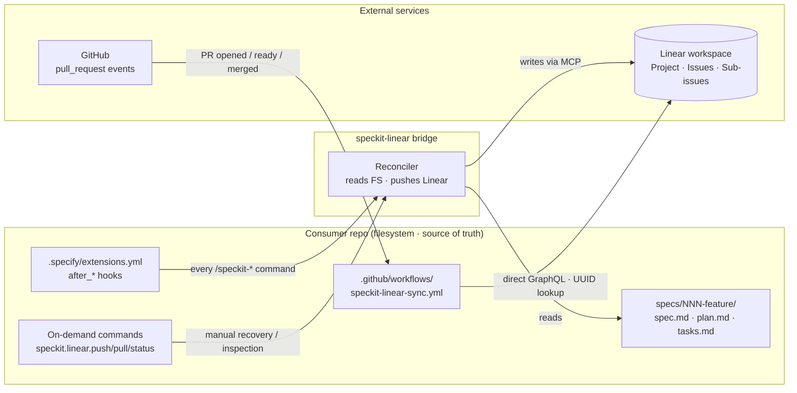
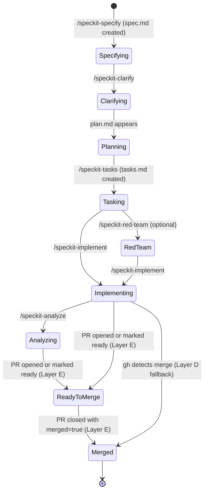
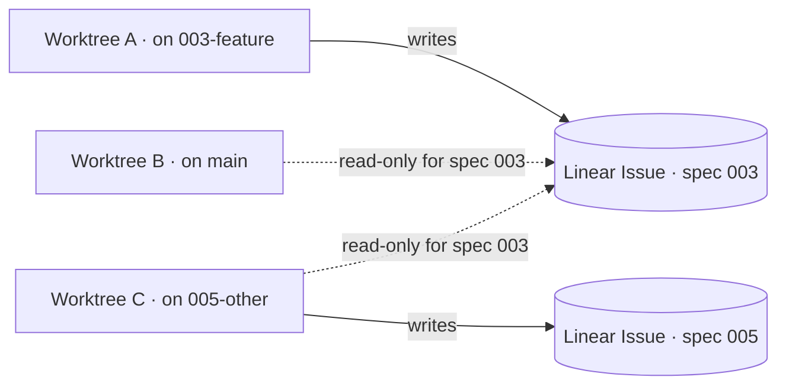

# speckit-linear

> A spec-kit extension that mirrors every spec on disk into Linear, so you can see — and steer — every active spec across every repo from a single Linear view.

 

---

## The problem

You're running spec-kit in four repos at once. `b9-backend` is mid-implementation on spec 003. `b9-frontend` is waiting on a clarify round. `project-arc` has a red-team pass open. `docs` is on `/speckit-plan`. Each repo has its own `specs/NNN-feature/` tree, its own feature branch, and — if you're disciplined about worktrees — its own working directory checked out somewhere on disk.

The filesystem holds every fact perfectly. Your head does not. You open the wrong worktree because you forgot which branch `005-…` lives on. You re-run `/speckit-clarify` because you can't remember whether the last round was ratified. You lose a session and spend twenty minutes reconstructing which spec is in which phase across which repo.

The artifacts are right there in markdown. There's just no single pane where you can stand back and see all of them.

## The solution

Linear becomes the consolidated memory layer. The filesystem stays the single source of truth — every spec, every clarify round, every task list is still a markdown file in `specs/NNN-feature/` — but `speckit-linear` reads that state and pushes it into Linear so each spec is a real Linear Issue with phase, branch, worktree, and current task visible at a glance.

The bridge is **reconcile-based**: every `/speckit-*` command fires a hook that reads the spec directory and pushes whatever Linear needs to match. Linear is the mirror. The filesystem wins every conflict. Reverse sync (Linear → disk) is explicitly out of scope.

## Data model

Spec-kit's artifacts map to Linear primitives like this (locked in spec.md §Overview):

| Filesystem concept | Linear primitive |
|---|---|
| Consumer repository | **Project** |
| Spec (`specs/NNN-feature/`) | **Issue** (one per spec, stamped with label `speckit-spec:NNN`) |
| Lifecycle phase | Workflow state on the spec Issue + a `phase:*` label |
| Task phase (`## Phase N:` in `tasks.md`) | **Sub-issue** under the spec Issue |
| Tasks within a phase | **Markdown checklist** in the sub-issue's description (read-only mirror) |
| Inter-task-phase ordering | Linear **blocking relations** between sub-issues |
| Clarify answers, plan summaries, red-team & analyze findings | **Comments** on the spec Issue |
| Branch / worktree / last-touched / current task | **Memory block** in the spec Issue's description |

Lifecycle phases tracked on the spec Issue's workflow state:

`Specifying` → `Clarifying` → `Planning` → `Tasking` → *(Red-team, optional)* → `Implementing` → `Analyzing` → `Ready-to-merge` → `Merged`

## How sync works

Three triggers keep Linear in sync. All three converge to the same state — they're independently idempotent, so any one of them alone is enough for correctness.



- **After-hook path (Layer D, primary).** `specify extension add linear` wires `after_specify`, `after_clarify`, `after_plan`, `after_tasks`, `after_implement`, and `after_analyze` into `.specify/extensions.yml`. Every `/speckit-*` invocation re-runs the full reconciler, so Linear catches up automatically without you remembering a sync step.
- **Webhook path (Layer E, real-time merge detection).** A GitHub Action installed in each consumer repo fires on `pull_request` events (`opened`, `ready_for_review`, `closed` with `merged: true`) and calls Linear's GraphQL API directly to flip the spec Issue's workflow state. This is what gives you sub-minute "Merged" updates without running any local command.
- **On-demand path (escape hatch).** `speckit.linear.push`, `speckit.linear.pull`, and `speckit.linear.status` let you trigger reconciliation manually — useful after a missed hook, after editing `tasks.md` outside a `/speckit-*` command, or just to inspect Linear's current view from the CLI.

## Phase mapping

The spec Issue's workflow state moves through the spec-kit lifecycle. Each transition is driven by a filesystem artifact appearing, a hook firing, or a GitHub event:



`Ready-to-merge` and `Merged` are normally driven by Layer E (the GitHub Action). If the Action isn't installed — operator declined, repo has Actions disabled, secret rotated — Layer D's next reconcile catches the merge via `gh pr view` (or git branch-reachability if `gh` is absent) and jumps the spec Issue straight to `Merged`. The intermediate `Ready-to-merge` state is lost in that degraded mode, but correctness is not.

## Write authority across worktrees

A spec can be checked out in more than one worktree at a time — typically one on its feature branch, one on `main`. To prevent a stale worktree from regressing Linear, the bridge enforces a single rule (FR-025): **only the worktree on a spec's feature branch may WRITE to that spec's Linear Issue**. Every other worktree's sync is read-only for that spec.



A read-only sync still surfaces Linear's current view to the operator (FR-026), so you can answer "what's done?" from any worktree without risking a regression.

## Architecture: D + E layers

Layer D (reconciliation) and Layer E (webhook) are independently idempotent. Either alone keeps Linear converging; both together cover live commits and retroactive merges.


If Layer E isn't installed, Layer D still converges to `Merged` on the next sync via `gh` (or git branch-reachability). If `gh` isn't installed either, the bridge can still tell merged-vs-not but loses the intermediate `Ready-to-merge` signal. The install step (FR-018b) verifies every dependency it touches and surfaces a clear status report — no silent degradation.

## Status

`v0.0.0-dev`. **Spec is locked; plan and tasks are not.**

This repo is currently in the spec-kit lifecycle for its own first release at `specs/001-spec-kit-linear-bridge/`. Install instructions, the CLI reference, and the seed workflow will land here once `/speckit-plan` and `/speckit-tasks` settle the implementation shape — we won't fabricate commands that don't exist yet.

In the meantime:

- **Design intent & decisions** — [`BRIEF.md`](./BRIEF.md)
- **Locked-in v1 specification** — [`specs/001-spec-kit-linear-bridge/spec.md`](./specs/001-spec-kit-linear-bridge/spec.md)
- **Pre-clarify research** — [`validation/`](./validation/) (Linear MCP capability matrix, GitHub Action mechanics, extension shape recon, Linear/GitHub integration survey, OSH-INFRA workspace probe)
- **Changelog** — [`CHANGELOG.md`](./CHANGELOG.md)

Bootstrapping note: this repo dogfoods spec-kit but **cannot** dogfood itself on spec 001 — the bridge it produces is what would sync 001 to Linear. Spec 002 onwards will retroactively sync 001 via Layer D once the bridge is live.

## Repository layout

```
speckit-linear/
├── BRIEF.md                          # kickoff brief — design decisions
├── README.md                         # you are here
├── CHANGELOG.md
├── LICENSE                           # MIT
├── .specify/                         # spec-kit scaffold for this repo's own lifecycle
│   ├── extensions.yml
│   ├── extensions/
│   ├── integrations/
│   ├── memory/                       # constitution & operator memory
│   ├── scripts/
│   ├── templates/
│   └── workflows/
├── specs/
│   └── 001-spec-kit-linear-bridge/   # v1 spec (locked) + checklists
├── validation/                       # pre-clarify research artifacts
└── .claude/skills/                   # spec-kit command skills used to drive this repo
```

## License

[MIT](./LICENSE) — © 2026 Ash Brener.
