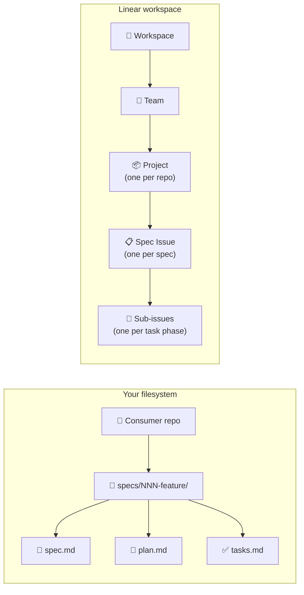
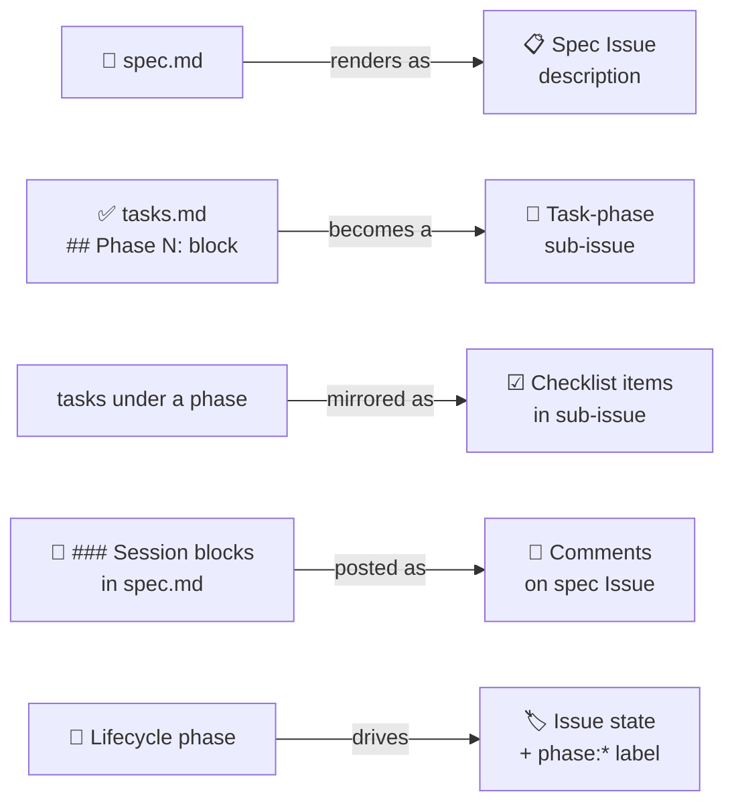
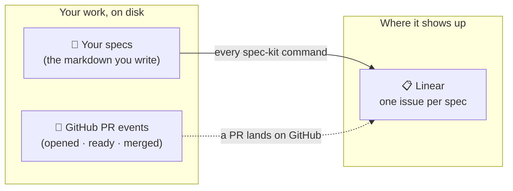
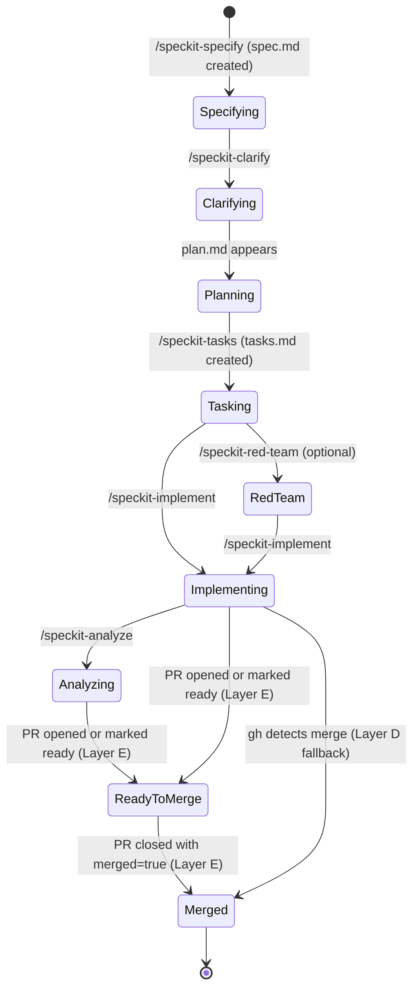
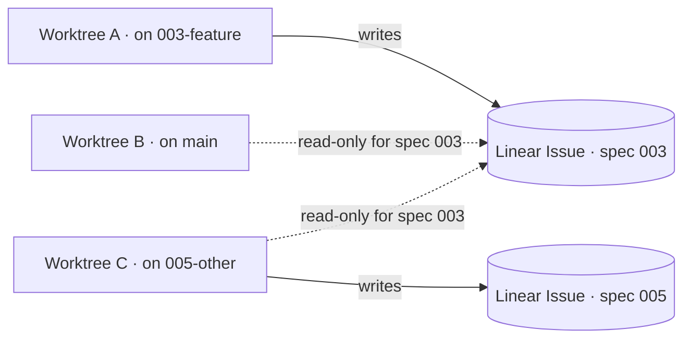
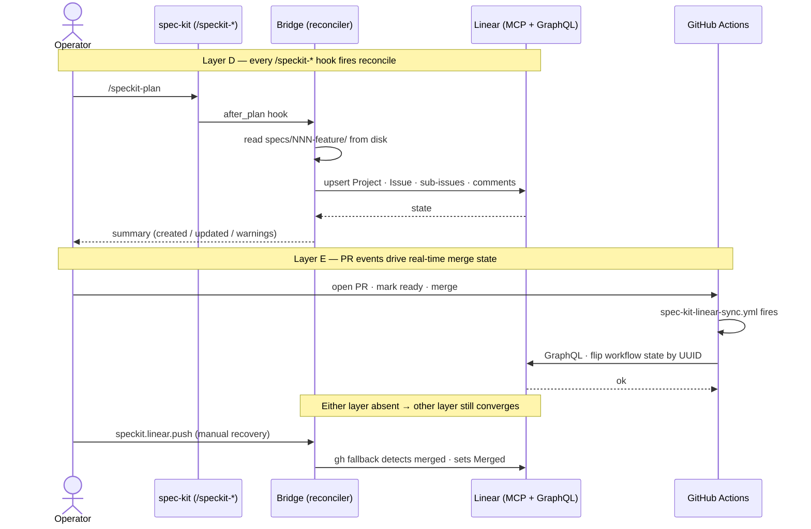

# spec-kit-linear

> A spec-kit extension that mirrors every spec on disk into Linear, so you can see — and steer — every active spec across every repo from a single Linear view.

 %20%C2%B7%20auto--fire%20%2B%20install%20ceremony%20in%20progress-brightgreen.svg)

---

## The problem

You're running spec-kit in four repos at once. `b9-backend` is mid-implementation on spec 003. `b9-frontend` is waiting on a clarify round. `project-arc` has a red-team pass open. `docs` is on `/speckit-plan`. Each repo has its own `specs/NNN-feature/` tree, its own feature branch, and — if you're disciplined about worktrees — its own working directory checked out somewhere on disk.

The filesystem holds every fact perfectly. Your head does not. You open the wrong worktree because you forgot which branch `005-…` lives on. You re-run `/speckit-clarify` because you can't remember whether the last round was ratified. You lose a session and spend twenty minutes reconstructing which spec is in which phase across which repo.

The artifacts are right there in markdown. There's just no single pane where you can stand back and see all of them.

## The solution

Linear becomes the consolidated memory layer. The filesystem stays the single source of truth — every spec, every clarify round, every task list is still a markdown file in `specs/NNN-feature/` — but `spec-kit-linear` reads that state and pushes it into Linear so each spec is a real Linear Issue with phase, branch, worktree, and current task visible at a glance.

The bridge is **reconcile-based**: every `/speckit-*` command fires a hook that reads the spec directory and pushes whatever Linear needs to match. Linear is the mirror. The filesystem wins every conflict. Reverse sync (Linear → disk) is explicitly out of scope.

## Current capabilities (v0.1.0-mvp)

The MVP slice (Phases 1–3, T001–T034 of [`specs/001-spec-kit-linear-bridge/tasks.md`](./specs/001-spec-kit-linear-bridge/tasks.md)) is shipped on the `001-spec-kit-linear-bridge` branch with CI green. Today the bridge can:

- **On-demand reconcile** via `speckit.linear.push` — manually invoked by an AI agent (no auto-firing yet).
- **Filesystem → Linear sync** of spec Issues, task-phase sub-issues, checklist mirrors, blocking relations between sub-issues, the structured memory block in each spec Issue's description, and clarify-session comments.
- **Idempotent** — re-running on unchanged state produces zero churn (no mutated timestamps, no new comments, no label re-application).
- **Write-authority gate** — only the worktree on a spec's feature branch may write to that spec's Linear Issue; sync from any other worktree is read-only for that spec (FR-025 / FR-026).
- **Direct Linear GraphQL** — the manual reconcile path requires no MCP runtime; an `LINEAR_API_KEY` in `.env` is sufficient.

The operator must currently set up `.specify/extensions/linear/linear-config.yml` by hand (Project/Team UUIDs + workflow state UUIDs) and manually run a `seed` step against the Linear workspace before the first push. The one-shot install ceremony that automates all of that is in `## Coming next`.

## Coming next

Phases 4–8 of [`specs/001-spec-kit-linear-bridge/tasks.md`](./specs/001-spec-kit-linear-bridge/tasks.md) still to ship:

- **One-shot install ceremony** — `specify extension add linear` with a smart Project/Team picker, automatic hook registration in `.specify/extensions.yml`, and full dependency verification per FR-018b.
- **Auto-fire on every `/speckit-*` lifecycle command** — `after_specify`, `after_clarify`, `after_plan`, `after_tasks`, `after_implement`, `after_analyze` hooks call the reconciler so Linear stays in sync without a manual step.
- **Local git hooks** — `post-checkout`, `post-commit`, `post-merge` for branch-switch awareness across worktrees.
- **Layer E GitHub Action webhook** — real-time PR-merge updates (`Ready-to-merge` → `Merged` within ~10s).
- **Workspace seed automation** — `speckit.linear.seed` creates the nine lifecycle workflow states + `phase:*` / `task-phase:*` labels and writes the resolved UUIDs back into `linear-config.yml`.
- **Cross-repo unified view commands** — `speckit.linear.pull` (read-only inspect) and `speckit.linear.status` (drift report).
- **Retroactive sync** of already-merged specs — jump straight to `Merged` without intermediate phase transitions cluttering Linear's activity log (FR-014).
- **Dogfood** — the bridge syncs its own spec 001 into the OSH-INFRA workspace.

Full task-by-task breakdown: [`specs/001-spec-kit-linear-bridge/tasks.md`](./specs/001-spec-kit-linear-bridge/tasks.md).

## Data model

Spec-kit's artifacts map to Linear primitives. Two views below — first the shape of each side, then the arrows that cross between them — followed by the canonical table.

### Structural hierarchy

Pure containment on each side. Disk on the left, Linear on the right. No arrows cross between them yet — that's the next diagram.



### What maps to what

The arrows that turn disk artifacts into Linear content. Short edge labels — each arrow is one sentence.



| Filesystem concept | Linear primitive |
|---|---|
| Consumer repository | **Project** |
| Spec (`specs/NNN-feature/`) | **Issue** (one per spec, stamped with label `speckit-spec:NNN`) |
| Lifecycle phase | Workflow state on the spec Issue + a `phase:*` label |
| Task phase (`## Phase N:` in `tasks.md`) | **Sub-issue** under the spec Issue |
| Tasks within a phase | **Markdown checklist** in the sub-issue's description (read-only mirror) |
| Inter-task-phase ordering | Linear **blocking relations** between sub-issues |
| Clarify answers, plan summaries, red-team & analyze findings | **Comments** on the spec Issue |
| Branch / worktree / last-touched / current task | **Memory block** in the spec Issue's description |

Lifecycle phases tracked on the spec Issue's workflow state:

`Specifying` → `Clarifying` → `Planning` → `Tasking` → *(Red-team, optional)* → `Implementing` → `Analyzing` → `Ready-to-merge` → `Merged`

## How sync works

You keep writing specs the way you always have. Linear keeps up on its own.



- **The everyday case.** You run `/speckit-plan` (or specify, clarify, tasks, implement, analyze) and Linear catches up in the same breath. No extra step, no separate sync command, no remembering.
- **The big moments.** A pull request lands on GitHub and the matching Linear issue flips to **Merged** within a minute — even if your laptop is closed.
- **The escape hatches.** Edited `tasks.md` by hand? Want to peek at what Linear thinks without writing? Run `speckit.linear.push`, `.pull`, or `.status` to reconcile or inspect on demand.

Your markdown is always the source of truth. Linear is the pane of glass you stand back and look through.

## Phase mapping

The spec Issue's workflow state moves through the spec-kit lifecycle. Each transition is driven by a filesystem artifact appearing, a hook firing, or a GitHub event:



`Ready-to-merge` and `Merged` are normally driven by Layer E (the GitHub Action). If the Action isn't installed — operator declined, repo has Actions disabled, secret rotated — Layer D's next reconcile catches the merge via `gh pr view` (or git branch-reachability if `gh` is absent) and jumps the spec Issue straight to `Merged`. The intermediate `Ready-to-merge` state is lost in that degraded mode, but correctness is not.

## Write authority across worktrees

A spec can be checked out in more than one worktree at a time — typically one on its feature branch, one on `main`. To prevent a stale worktree from regressing Linear, the bridge enforces a single rule (FR-025): **only the worktree on a spec's feature branch may WRITE to that spec's Linear Issue**. Every other worktree's sync is read-only for that spec.



A read-only sync still surfaces Linear's current view to the operator (FR-026), so you can answer "what's done?" from any worktree without risking a regression.

## Architecture: D + E layers

Layer D (reconciliation) and Layer E (webhook) are independently idempotent. Either alone keeps Linear converging; both together cover live commits and retroactive merges.



If Layer E isn't installed, Layer D still converges to `Merged` on the next sync via `gh` (or git branch-reachability). If `gh` isn't installed either, the bridge can still tell merged-vs-not but loses the intermediate `Ready-to-merge` signal. The install step (FR-018b) verifies every dependency it touches and surfaces a clear status report — no silent degradation.

## Status

`v0.1.0-mvp`. **Spec, plan, and tasks all locked; MVP shipped.**

- Spec complete ✓
- Plan complete ✓
- Tasks complete ✓
- **Phase 1** (Setup) ✓
- **Phase 2** (Foundational — 5 bash modules + 102 unit tests + 5 fixtures) ✓
- **Phase 3** (US1 — MVP reconciler + integration tests) ✓
- **Phases 4–8** in progress (see [Coming next](#coming-next))
- **CI**: green on `001-spec-kit-linear-bridge` ([latest run](https://github.com/ashbrener/spec-kit-linear/actions?query=branch%3A001-spec-kit-linear-bridge))

This repo is in the spec-kit lifecycle for its own first release at `specs/001-spec-kit-linear-bridge/`. The full install ceremony, the CLI reference for the auto-firing path, and the seed workflow land in Phases 4–8.

In the meantime:

- **Design intent & decisions** — [`BRIEF.md`](./BRIEF.md)
- **Locked-in v1 specification** — [`specs/001-spec-kit-linear-bridge/spec.md`](./specs/001-spec-kit-linear-bridge/spec.md)
- **Pre-clarify research** — [`validation/`](./validation/) (Linear MCP capability matrix, GitHub Action mechanics, extension shape recon, Linear/GitHub integration survey, OSH-INFRA workspace probe)
- **Changelog** — [`CHANGELOG.md`](./CHANGELOG.md)

Bootstrapping note: this repo dogfoods spec-kit but **cannot** dogfood itself on spec 001 — the bridge it produces is what would sync 001 to Linear. Spec 002 onwards will retroactively sync 001 via Layer D once the bridge is live.

## Repository layout

```
spec-kit-linear/
├── BRIEF.md                          # kickoff brief — design decisions
├── README.md                         # you are here
├── CHANGELOG.md
├── LICENSE                           # MIT
├── .specify/                         # spec-kit scaffold for this repo's own lifecycle
│   ├── extensions.yml
│   ├── extensions/
│   ├── integrations/
│   ├── memory/                       # constitution & operator memory
│   ├── scripts/
│   ├── templates/
│   └── workflows/
├── specs/
│   └── 001-spec-kit-linear-bridge/   # v1 spec (locked) + checklists
├── validation/                       # pre-clarify research artifacts
└── .claude/skills/                   # spec-kit command skills used to drive this repo
```

## License

[MIT](./LICENSE) — © 2026 Ash Brener.
